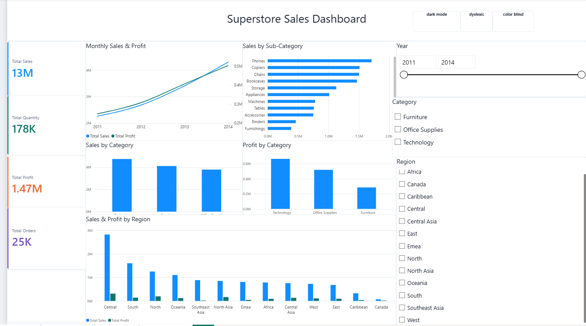
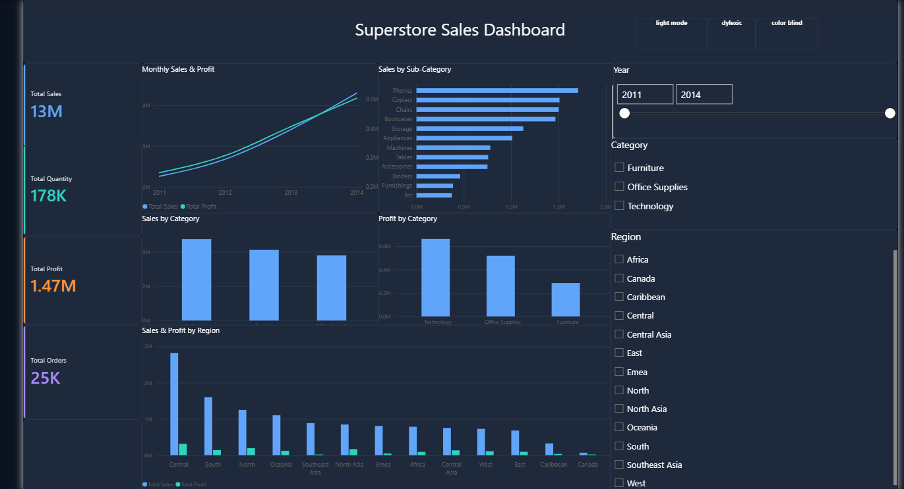
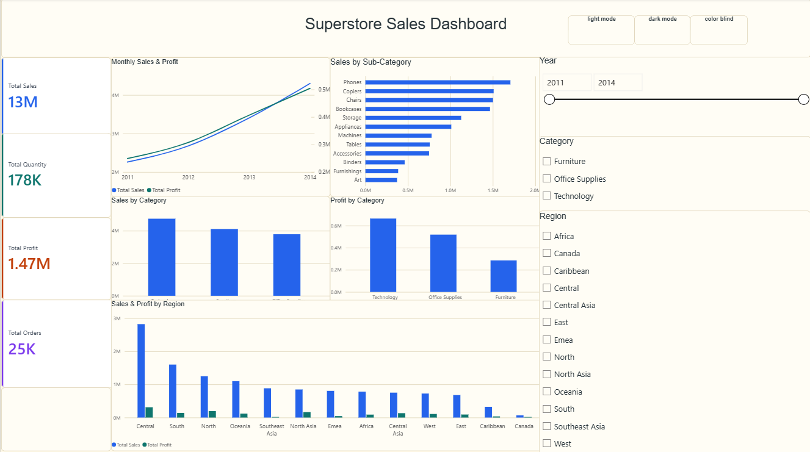
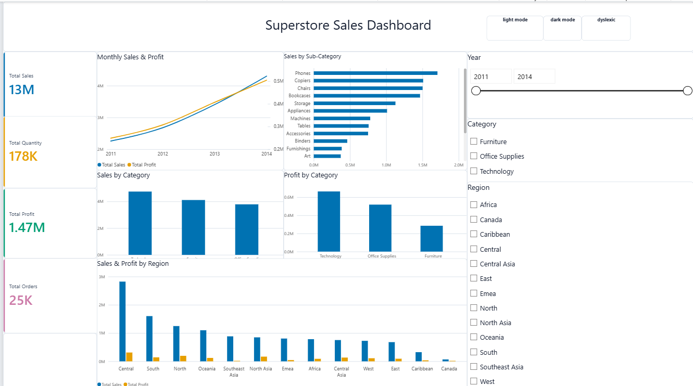
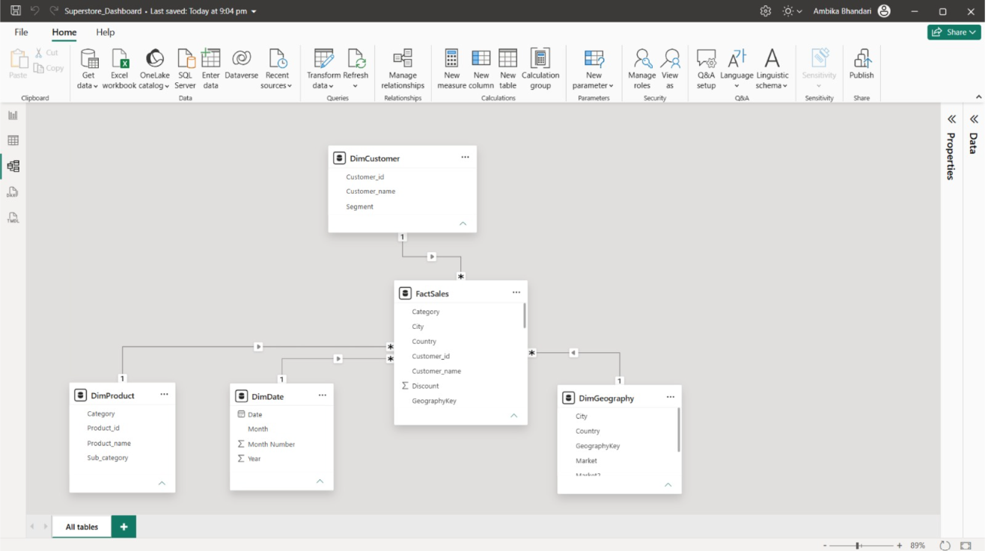

From Messy CSV to Trusted Dashboard [MICROSOFT INNOVATE 2026]

What This Project Does
Raw CSV datasets are often messy: mixed encodings, broken values, inconsistent formats, missing values and duplicates.
Dashboards are frequently built on top of this data without anyone verifying that it is clean.

What This Project Does
Raw CSV datasets are often messy: mixed encodings, broken values, inconsistent formats, missing values and duplicates. Dashboards are frequently built on top of this data without anyone verifying that it is clean.
Our pipeline fixes that. It:
Detects and fixes encoding issues, inconsistent formats, missing values, and duplicates.
Flags ambiguous or suspicious data for human review instead of silently deleting it.
Generates a plain-English documentation report of every change made.
Feeds a clean dataset into Power BI, modeled as a star schema, for an accessible dashboard.

What makes it different
Dyslexia- and colour-blind-friendly dashboard design, with light/dark mode.

Technology used
Purpose                                                       	Tool
Data cleaning and validation	                                Python (pandas)
Transformation	                                                Power Query
Data modelling	                                                Star schema
Visualization                                                 	Microsoft Power BI
Version control / editor                                      	Git, VS Code
Documentation	                                                README + Data Dictionary
Dataset	                                                        Kaggle Superstore dataset

Dashboard Screenshots
1. Light Mode

2. Dark Mode

3. Dyslexic Mode

4. Color Blind

Star Schema

Team
Name	                         Enrollment No.                  	Role
Palak Singh	                      S25CSEU1669	                    Team Leader
Ambika Bhandari	                  S25CSEU1680	                    Developer
Diksha Joshi	                  S25CSEU1685	                    Designer

References
Kaggle Superstore dataset
Microsoft Power BI and Power Query documentation